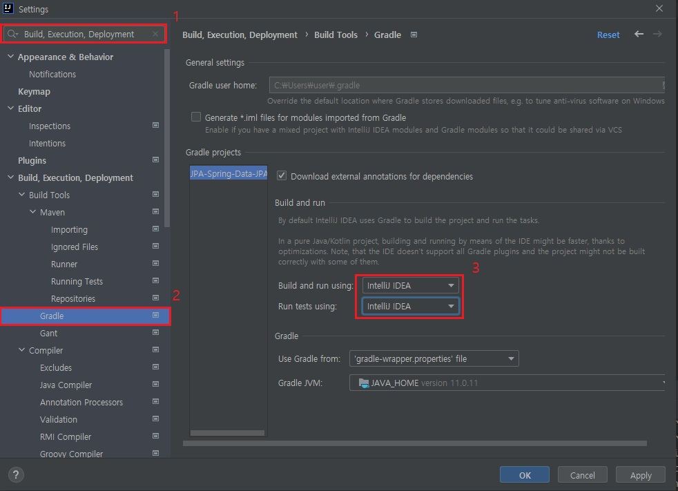
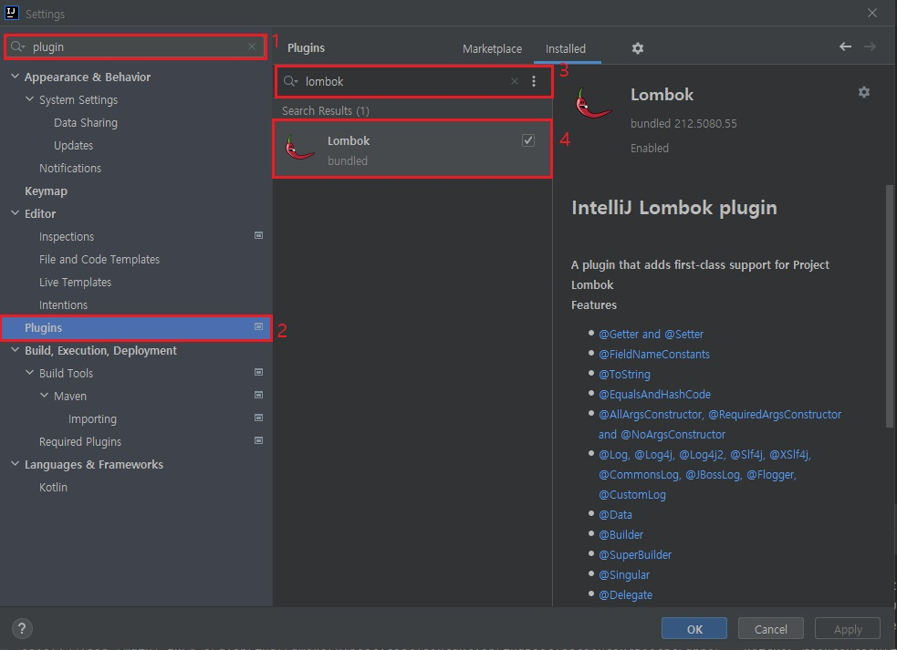
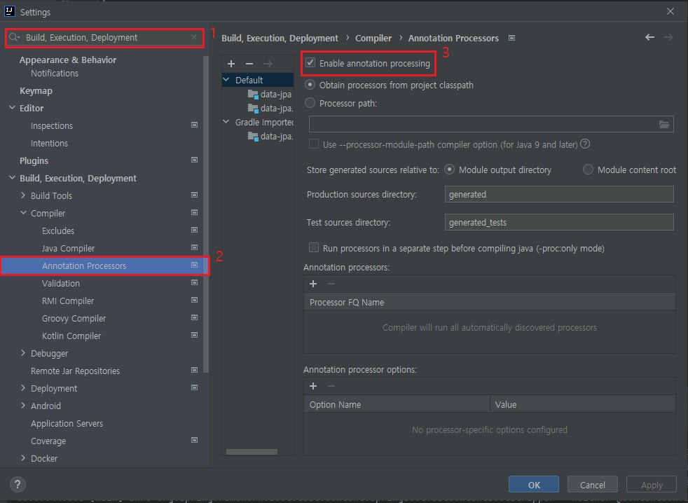

# 인텔리제이 환경설정

## JUit 설정

- Juit으로 테스트 코드 실행시 오래걸리는 문제 해결, 최신버전 IntelliJ 에서 Java를 바로 실행하는 것이 아닌 gradle을 통해서 실행하기 때문에 시간이 오래걸리기 때문에 아래 환경설정을 한다. 

Mac : Preferences -> Build, Execution, Deployment 검색 -> 하위 탭 중 Gradle 선택 후 아래와 같이 설정  

Windows : File -> Settings -> Build, Execution, Deployment 검색 -> 하위 탭 중 Gradle 선택 후 아래와 같이 설정

 

- 아래

Build and run suing : intelliJ IDEA  
Run test using : intelliJ IDEA  

  

# Lombok 설치
1. Mac : Preferences -> plugin 검색후 - lombok설치  
   Windows : file - setting -> plugin 검색후 - lombok설치 

2. Build, Execution, Deployment 검색후 하위 Compiler 하위 Annotation Processors -> Enable annotation processing 체크  

# html수정후 재시작 하지 않고 소스 반영하도록 설정
build.gradle 에   
	implementation 'org.springframework.boot:spring-boot-devtools'  
추가후 서버 재기동 하면 restartedMain으로 나온다면 설정완료  
html 수정후 Build -> recompile 하면 된다  
