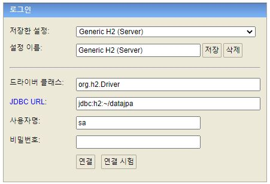
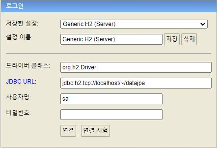
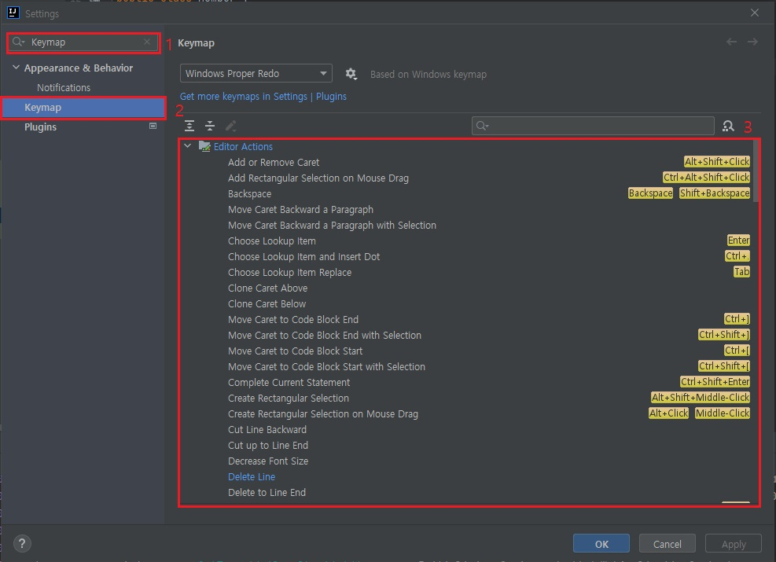
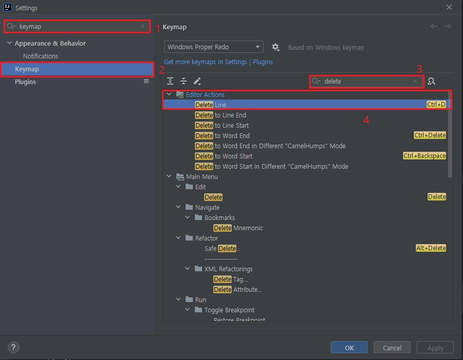

# 인텔리제이 환경설정

## JUit 설정

- Juit으로 테스트 코드 실행시 오래걸리는 문제 해결, 최신버전 IntelliJ 에서 Java를 바로 실행하는 것이 아닌 gradle을 통해서 실행하기 때문에 시간이 오래걸리기 때문에 아래 환경설정을 한다.<br>

Mac : Preferences -> Build, Execution, Deployment 검색 -> 하위 탭 중 Gradle 선택 후 아래와 같이 설정 <br>

Windows : File -> Settings -> Build, Execution, Deployment 검색 -> 하위 탭 중 Gradle 선택 후 아래와 같이 설정

<br>

- 아래

Build and run suing : intelliJ IDEA <br>
Run test using : intelliJ IDEA <br>


<br><br>

# Lombok 설치
1. Mac : Preferences -> plugin 검색후 - lombok설치 <br>
   Windows : file - setting -> plugin 검색후 - lombok설치<br>

2. Build, Execution, Deployment 검색후 하위 Compiler 하위 Annotation Processors -> Enable annotation processing 체크 <br>


<br><br>

# html수정후 재시작 하지 않고 소스 반영하도록 설정
build.gradle 에  <br>
	implementation 'org.springframework.boot:spring-boot-devtools' <br>
추가후 서버 재기동 하면 restartedMain으로 나온다면 설정완료 <br>
html 수정후 Build -> recompile 하면 된다 <br>

<br><br>

# H2 데이터베이스 설치

- 개발이나 테스트 용도로 가볍고 편리한 DB, 웹 화면 제공

- 다운로드 및 설치
   - https://www.h2database.com
   - h2 데이터베이스 버전은 스프링 부트 버전에 맞춘다.
   - MAC의 경우 권한 주기: chmod 755 h2.sh

<br>

- 데이터베이스 파일 생성 방법
   - jdbc:h2:~/DB이름 (최소 한번)
   - MAC : ~/DB이름.mv.db 파일 생성 확인
	- Windows : C:/사용자/user 하위에 DB이름.mv.db 파일 생성 확인
   - 이후 부터는 jdbc:h2:tcp://localhost/~/DB이름 이렇게 접속 (위의 DB이름.mv.db 파일이 생성되어야 tcp로 접속할수 있다)

- 최초 아래와 같이 접속 ( jdbc:h2:~/datajpa)


- 이후 아래와 같이 접속 ( jdbc:h2:tcp://localhost/~/datajpa )


위 순서로 하지 않으면 database 파일이 생성되지 않아서 접속이 되지 않는다.

<br><br>

# 단축키 등록

Mac : Preferences -> Keymap 검색 -> Editor Actions 에서 원하는 단축키로 설정할수 있다. <br>
Windows : File -> Settings -> Keymap 검색 -> Editor Actions 에서 원하는 단축키로 설정할수 있다. <br>




<br>

필자는 한줄 삭제가 단축키로 등록되어있지 않아 아래와 같이 Ctrl + D 단축키로 수동으로 등록했다.




<br><br>

# JPA 사용시 쿼리 파라미터 남기기

- 외부 라이브러리 사용
- https://github.com/gavlyukovskiy/spring-boot-data-source-decorator
- 스프링 부트를 사용하면 이 라이브러리만 추가하면 된다.

- build.gradle -> dependencies에 implementation 'com.github.gavlyukovskiy:p6spy-spring-boot-starter:1.5.7' 를 추가한다.

```
...
dependencies {
	implementation 'org.springframework.boot:spring-boot-starter-data-jpa'
	implementation 'org.springframework.boot:spring-boot-starter-web'
	implementation 'com.github.gavlyukovskiy:p6spy-spring-boot-starter:1.5.8' <-- 추가
	compileOnly 'org.projectlombok:lombok'
	runtimeOnly 'com.h2database:h2'
	annotationProcessor 'org.projectlombok:lombok'
	testImplementation('org.springframework.boot:spring-boot-starter-test') {
		exclude group: 'org.junit.vintage', module: 'junit-vintage-engine'
	}
}
...
```
> 참고: 쿼리 파라미터를 로그로 남기는 외부 라이브러리는 시스템 자원을 사용하므로, 개발 단계에서는 편하게 사용해도 된다. 하지만 운영시스템에 적용하려면 꼭 성능테스트를 하고 사용하는 것이 좋다